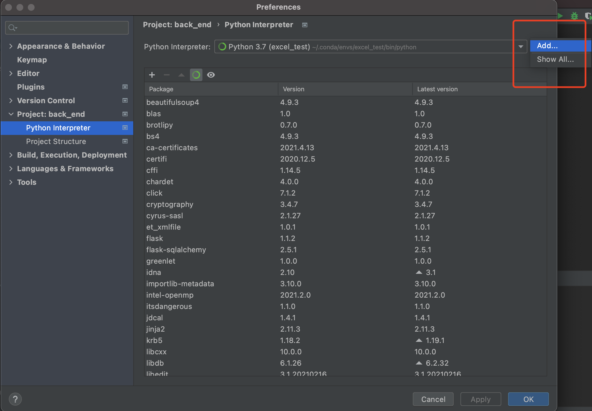
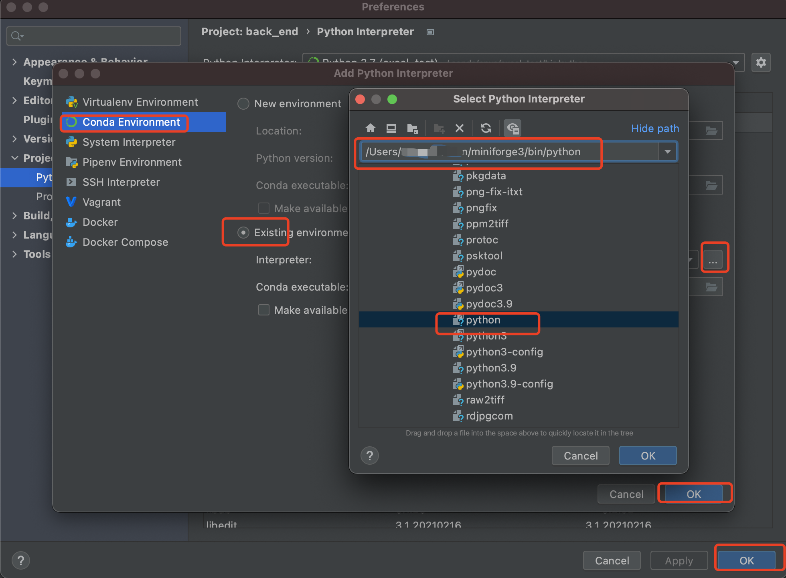

anaconda里面python库都是3.9以下的x86软件库，好多东西需要自己交叉编译才能支持 <br />
conda针对osx arm64用的是miniforge, conda-forge <br />

这个是macos miniforge的安装脚本
```
https://github.com/conda-forge/miniforge/releases/latest/download/Miniforge3-MacOSX-arm64.sh
```

### 下面是安装流程和使用流程
#### 1. 安装miniforge3
```
$ chmod +x ./Miniforge3-MacOSX-arm64.sh
$ ./Miniforge3-MacOSX-arm64.sh
$ #完成后
$ conda config --set auto_activate_base false
$ #更换channels 清华，默认的我删掉了
$ conda config --set channels https://mirrors.tuna.tsinghua.edu.cn/anaconda/cloud/conda-forge/
```

#### 2.设置环境变量
```
$ vim .zshrc
$ #注释掉 原来的anaconda的bin，增加miniforge的环境变量
$ export PATH=/Users/YOURNAME/miniforge3/bin:$PATH
```

#### 3.更换pycharm的interpreter



本文参考：https://www.toutiao.com/i6950101327934423590/?group_id=6950101327934423590
